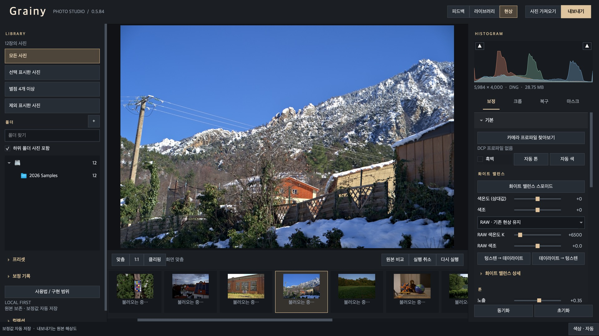
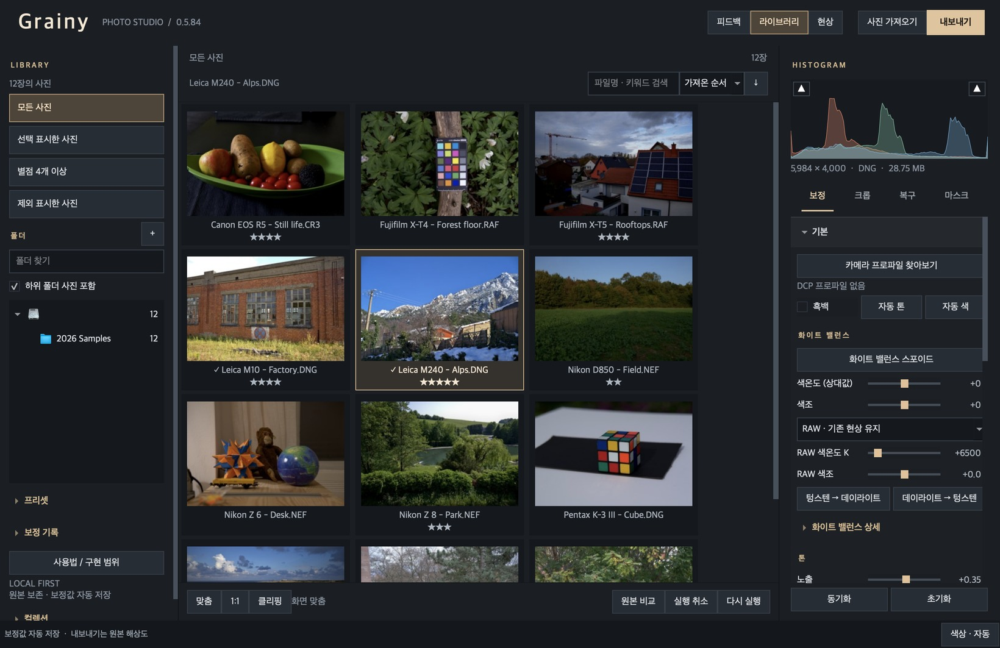
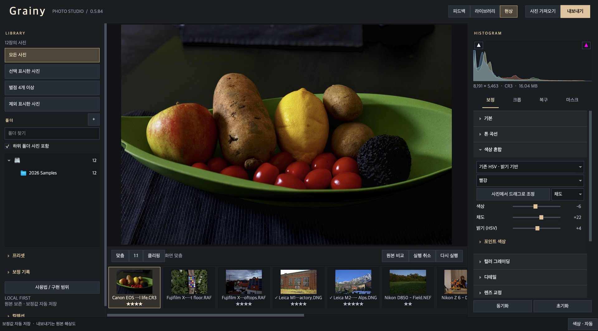
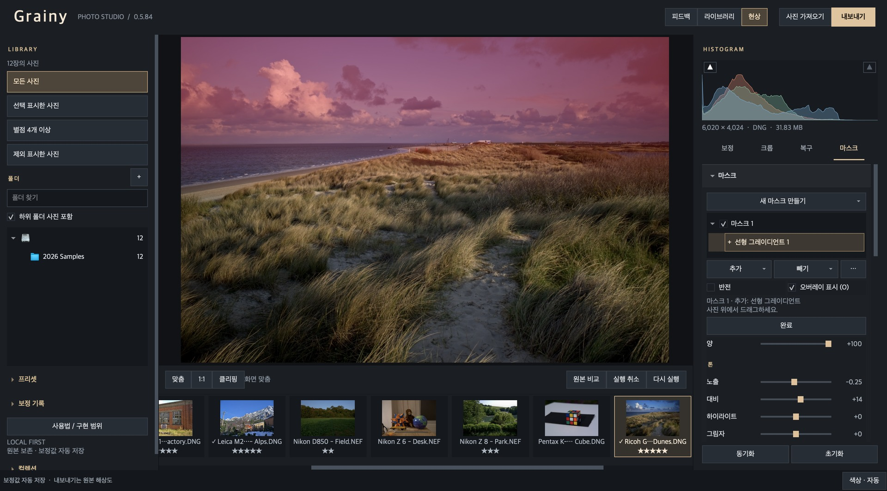
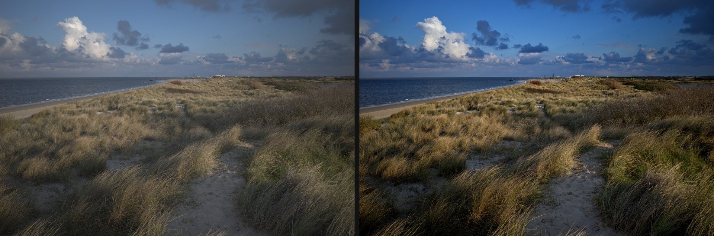

# Grainy

[](https://github.com/pastorius9/grainy/releases/latest)
[](https://github.com/pastorius9/grainy/releases)
[](LICENSE)

[English](README.md) · **한국어**

Windows와 macOS용 사진 보정·관리 프로그램입니다. 원본 사진은 건드리지 않고, 보정 내용을 보관함(카탈로그)에 따로 저장합니다.



- **무료, 로컬.** 계정도 구독도 없고 사용 통계를 수집하지 않습니다. 사진과 보정 기록은 내 컴퓨터에만 있습니다.
- **RAW 현상.** 공개 RAW 샘플 15종 중 14종이 열립니다: Canon, Nikon, Fujifilm(X-Trans), Leica, Sony, Panasonic, Olympus, Pentax, Ricoh. Nikon의 고효율(HE) 압축 NEF는 열리지 않습니다.
- **그래픽카드 가속.** Windows는 Direct3D 11, macOS는 Metal을 씁니다. M1 Pro에서 2,400만 화소 사진의 전체 현상(노이즈 제거·선명도 포함)이 CPU만으로 8.2초, 가속을 켜면 1.6초였습니다(1회 측정). 가속 결과와 CPU 결과의 차이는 8비트 한 단계 이하입니다.
- **필름 스캔을 위한 도구.** 먼지·스크래치 자동 감지와 제거, 텅스텐↔데이라이트 색온도 변환.
- **Lightroom에서 옮겨 오기.** 카탈로그(별점·플래그·컬렉션·보정값)와 프리셋을 가져옵니다.

## 화면

### 보관함

폴더를 등록하면 새 사진을 알아서 가져옵니다. 별점, 플래그, 색 라벨, 키워드, 컬렉션과 스마트 컬렉션으로 정리합니다.



### 톤과 색

노출, 톤 곡선과 채널 곡선, 8색 혼합, 컬러 그레이딩, 카메라 프로파일(DCP), 렌즈 보정(Lensfun). 보정은 저장 버튼 없이 바로 기록되고 단계마다 되돌릴 수 있습니다.



### 부분 보정

브러시, 선형·방사형 그레이디언트, 색상·광도 범위로 영역을 고르고 추가·빼기·교차로 조합합니다. 아래는 하늘에만 건 선형 그레이디언트입니다.



### 가져온 그대로와 보정 후



왼쪽은 RAW를 가져온 그대로, 오른쪽은 기본 보정과 위의 하늘 마스크를 적용한 결과입니다.

화면의 사진은 모두 [raw.pixls.us](https://raw.pixls.us)의 CC0 공개 샘플입니다(Leica M (Typ 240), Ricoh GR III, Canon EOS R5 등). 화면은 실제 프로그램을 자동으로 조작해 찍었습니다.

## 받기와 실행

1. Releases에서 `Grainy-<버전>-windows-x64.zip`을 받아 원하는 폴더에 풉니다.
2. `Grainy.exe`를 실행합니다.
3. 코드 서명이 없어 처음 실행할 때 Windows가 "알 수 없는 게시자" 경고를 보여 줍니다.

- Windows 10/11 64비트가 필요합니다.
- 보관함은 `%LOCALAPPDATA%\Luma\Library`에 만들어집니다.

### macOS (Apple Silicon)

1. Releases에서 `Grainy-<버전>-macos-arm64.dmg`를 받아 열고, Grainy를 응용 프로그램 폴더로 끌어다 놓습니다.
2. 처음 실행하면 macOS가 확인되지 않은 개발자의 앱이라며 막습니다. `시스템 설정 → 개인정보 보호 및 보안`에서 "그래도 열기"를 한 번 누르면 됩니다. Apple 개발자 서명과 공증이 없기 때문입니다.

- Apple Silicon(M1 이후) Mac과 macOS 14 이상이 필요합니다. Intel Mac은 지원하지 않습니다.
- 보관함과 설정은 `~/Library/Application Support/Grainy/`에 만들어집니다.
- macOS 버전은 0.5.84가 첫 배포입니다. 자동 시험은 통과했지만 여러 사람의 Mac에서 써 본 것은 아닙니다. 문제는 피드백 버튼으로 알려 주세요.

## 삭제

- 압축을 푼 Grainy 폴더를 지우면 프로그램이 삭제됩니다. 레지스트리나 시스템 설정은 건드리지 않습니다.
- 보정 기록까지 지우려면 `%LOCALAPPDATA%\Luma`(보관함)와 `%LOCALAPPDATA%\Grainy`(설정) 폴더도 지웁니다. 사진 원본은 이 폴더들에 없습니다.
- macOS: 응용 프로그램 폴더의 Grainy를 휴지통으로 옮깁니다. 보정 기록까지 지우려면 `~/Library/Application Support/Grainy` 폴더도 지웁니다.

## 기능

- **보관함**: 폴더 가져오기, 등록한 폴더의 새 사진 자동 가져오기, 별점·색 라벨·키워드, 컬렉션과 스마트 컬렉션, 폴더 위치 복구
- **RAW 현상**: 주요 카메라 RAW, 카메라 프로파일(DCP), 렌즈 보정(Lensfun)
- **보정**: 노출·톤 커브·채널 커브·색상 혼합·컬러 그레이딩, 자동 톤, 자동 색(색 틀어짐 보정), 필름 색온도 변환(텅스텐↔데이라이트)
- **디테일**: 선명도, 노이즈 제거, 그레인, 비네팅
- **부분 보정**: 마스크(브러시, 선형·방사형 그레이디언트, 색상·광도 범위, 추가·빼기·교차), 힐링, 먼지 제거
- **내보내기**: JPEG, PNG, TIFF, AVIF, JPEG XL
- **피드백**: 화면 위쪽 버튼으로 문제점이나 개선 아이디어를 바로 보낼 수 있습니다
- **업데이트**: 프로그램 안에서 새 버전을 확인하고 바로 교체합니다
- **기타**: 편집 이력과 실행 취소, Lightroom 카탈로그·프리셋 가져오기, 카탈로그 백업(Google Drive 폴더 포함), GPS 지도

자세한 사용법은 프로그램에 들어 있는 도움말(`README.html`)에 있습니다.

## 개인정보

- 사용 통계를 수집하지 않습니다. 인터넷으로 나가는 것은 아래 두 가지뿐이고, 둘 다 직접 요청했을 때만 동작합니다.
- **피드백 보내기**: 보내기를 누를 때만 입력한 글, Grainy 버전, 컴퓨터 사양 한 줄(운영체제 버전, 그래픽카드 이름)이 전송됩니다. 사진, 파일 이름과 경로, 사용자 이름은 보내지 않습니다.
- **업데이트**: "업데이트 확인"을 누르거나 "새 버전 자동 확인"을 켰을 때만 GitHub에서 최신 버전 정보를 읽습니다(자동 확인은 처음 실행할 때 켤지 묻고, 설정에서 끌 수 있습니다). 사용자에 관한 정보는 보내지 않습니다.

## 소스에서 실행

```bash
python -m venv .venv
.venv\Scripts\pip install -r requirements.txt
.venv\Scripts\python main.py
```

그래픽카드 가속과 색 변환용 C++ 모듈은 `tools/build_native_*.py`로 빌드합니다(Windows는 Visual Studio C++ 도구, macOS는 `tools/build_native_macos.py`와 Xcode 명령줄 도구). 테스트는 `python tools/check.py`이고 1,200개가 넘습니다.

## 라이선스

Grainy 자체의 코드는 [MIT 라이선스](LICENSE)입니다. 사용·수정·재배포·상업적 이용이 자유롭고, 저작권 표시와 라이선스 문구만 유지하면 됩니다. "Grainy" 이름과 로고는 라이선스 대상이 아닙니다.

함께 배포되는 외부 부품은 각자의 라이선스를 따릅니다. Qt/PySide6(LGPL-3.0), LibRaw, OpenCV, Lensfun 등을 사용합니다. 전체 목록과 조건은 [DISTRIBUTION.md](DISTRIBUTION.md)에, 고지문은 배포본의 `THIRD_PARTY_LICENSES` 폴더에 있습니다.

Adobe, Lightroom, Photoshop은 Adobe Inc.의 상표입니다. Grainy는 Adobe가 만들거나 후원·보증한 프로그램이 아니며 Adobe와 관련이 없습니다.

## 코드 서명 정책

배포 파일은 아직 서명되어 있지 않습니다. 정책 전문은 [영어 README의 Code signing policy](README.md#code-signing-policy)에 있습니다.
