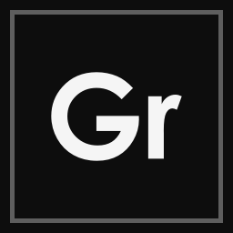
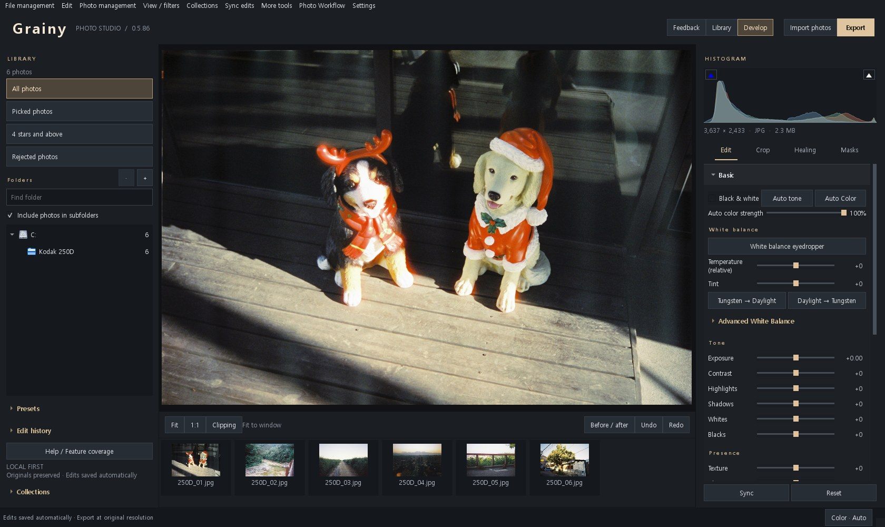
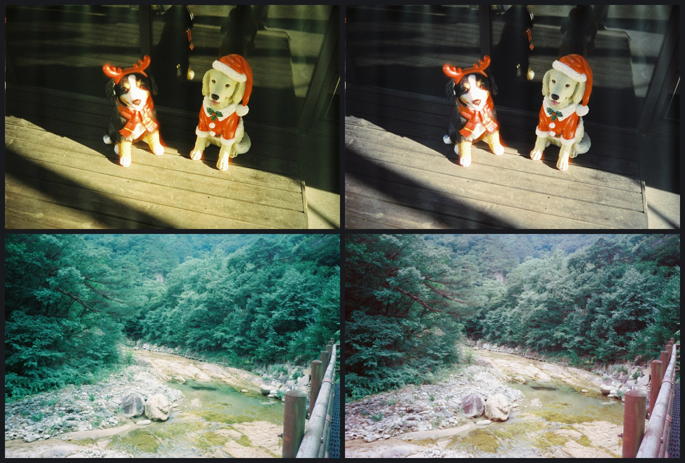
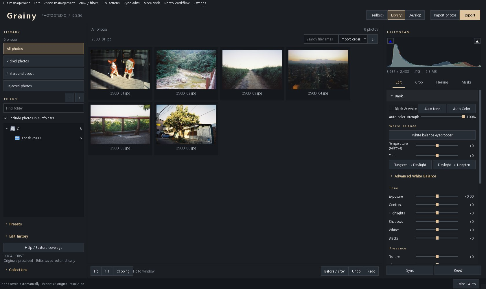
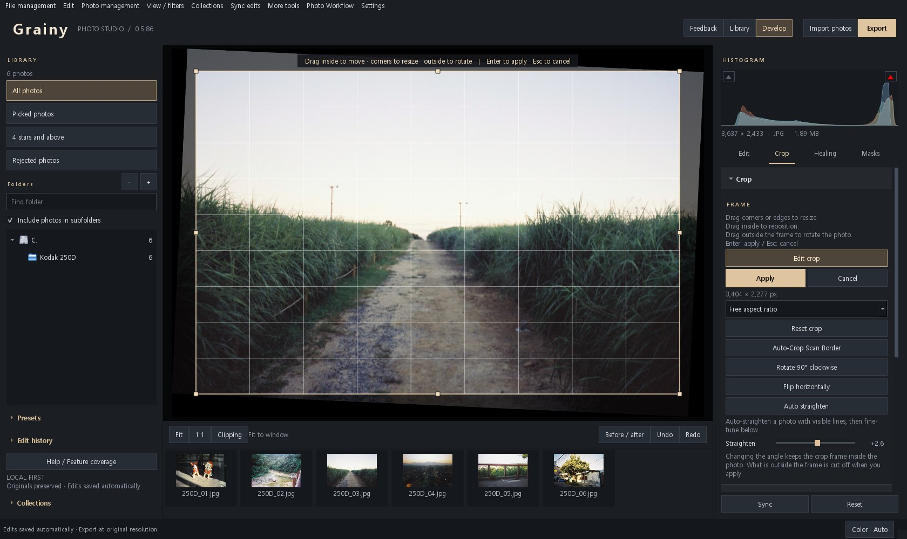
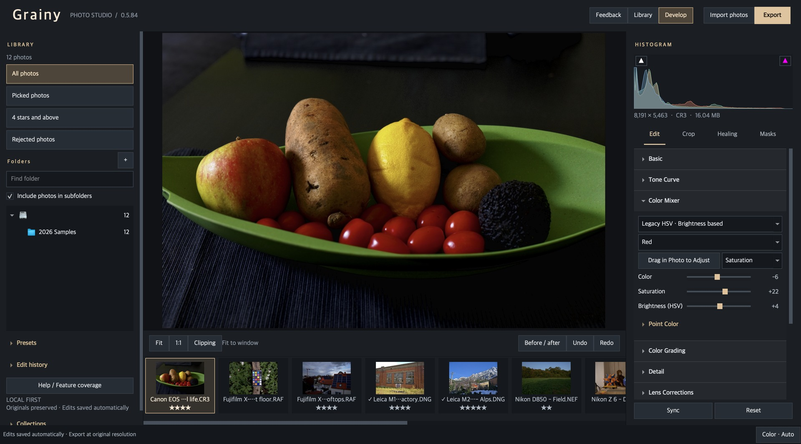
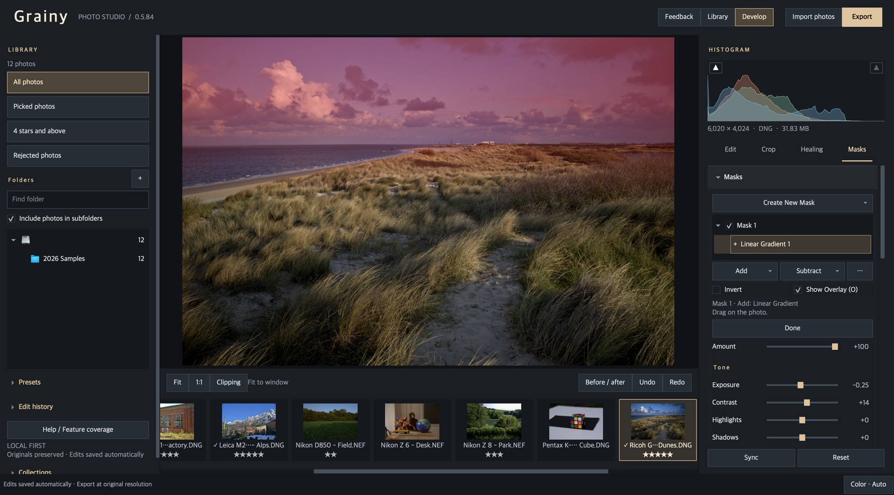

<p align="center">
  
</p>

<h1 align="center">Grainy</h1>

<h3 align="center">A free photo editor and library, made for film scans.</h3>

<p align="center">
  Fix a scan's colour cast with one button, clean up dust, crop and straighten, and keep every roll in one library.<br>
  RAW files too. No account, no subscription, and your photos never leave your computer.
</p>

<p align="center">
  <a href="https://github.com/pastorius9/grainy/releases/latest"></a>
  <a href="https://github.com/pastorius9/grainy/releases"></a>
  
  <a href="LICENSE"></a>
</p>

<p align="center">
  <a href="https://github.com/pastorius9/grainy/releases/latest"></a>
  &nbsp;
  <a href="https://github.com/pastorius9/grainy/releases/latest"></a>
</p>

<p align="center"><b>English</b> · <a href="README.ko.md">한국어</a></p>



## One button for colour casts

Lab scans often come back yellow, green or blue. **Auto Colour** looks at the shadows, the midtones and the highlights separately and corrects each with channel curves, because a film scan is rarely off by the same amount everywhere. One white balance value cannot do that.



Left: the scans as they came from the lab. Right: after one press of Auto Colour, with no other adjustment.

- Photos lit by coloured light (a concert, a neon sign) are left alone.
- A strength slider sets how far the correction goes. A very strong cast does not come back completely.
- Tungsten film shot in daylight, or the other way round, has its own one-button conversion.

## Why Grainy

- **Free and local.** No account, no subscription, no usage statistics. Photos and edits stay on your computer, and your originals are never modified.
- **Made for film scans.** Auto Colour, automatic detection of dust and scratches that you review before anything is removed, cropping of scan borders, grain.
- **RAW development.** 14 of 15 public RAW samples open: Canon, Nikon, Fujifilm (X-Trans), Leica, Sony, Panasonic, Olympus, Pentax, Ricoh. Nikon's High Efficiency (HE) compressed NEF does not.
- **GPU acceleration.** Direct3D 11 on Windows, Metal on macOS. On an M1 Pro, fully developing a 24 MP photo (with noise reduction and sharpening) took 8.2 s on the CPU alone and 1.6 s with acceleration (measured once). The accelerated result is within one 8-bit step of the CPU result.
- **Lightroom catalogs.** Imports Lightroom catalogs (ratings, flags, collections, develop settings) and presets.

## Screens

### Library

Register a folder and new photos are imported as they appear. Organise with ratings, flags, colour labels, keywords, collections and smart collections.



### Crop and straighten

Auto straighten finds the angle and puts it on the slider. Drag outside the frame to turn the photo; the crop frame follows so that no empty corner is left.



### Tone and colour

Exposure, tone and channel curves, an eight-colour mixer, colour grading, camera profiles (DCP) and lens corrections (Lensfun). Edits are recorded as you make them, with no Save button, and every step can be undone.



### Local adjustments

Select areas with a brush, linear and radial gradients, or colour and luminance ranges, and combine them by adding, subtracting and intersecting. Below, a linear gradient on the sky only.



### RAW, as imported and developed


Left: the RAW file as imported. Right: with basic adjustments and the sky mask above.

The film scans on this page are the author's own. The other photos are CC0 samples from [raw.pixls.us](https://raw.pixls.us) (Leica M (Typ 240), Ricoh GR III, Canon EOS R5 and others). The screenshots were taken by driving the real program automatically.

## Download and run

### Windows

1. Download `Grainy-<version>-windows-x64.zip` from Releases and unpack it wherever you like.
2. Run `Grainy.exe`.
3. The program is not code-signed, so Windows shows an "unknown publisher" warning the first time.

- Windows 10/11, 64-bit.
- The library is created in `%LOCALAPPDATA%\Luma\Library`.

### macOS (Apple Silicon)

1. Download `Grainy-<version>-macos-arm64.dmg` from Releases, open it and drag Grainy to the Applications folder.
2. On first start macOS blocks the app as coming from an unidentified developer. Press "Open Anyway" once in `System Settings → Privacy & Security`. The app has no Apple developer signature or notarization.

- An Apple Silicon Mac (M1 or later) and macOS 14 or later. Intel Macs are not supported.
- The library and settings are created in `~/Library/Application Support/Grainy/`.
- 0.5.84 is the first macOS release. It passes the automated tests but has not been used on many people's Macs. Please report problems with the Feedback button.

## Uninstall

- Windows: delete the unpacked Grainy folder. Nothing is written to the registry or system settings.
- To remove the edits as well, delete `%LOCALAPPDATA%\Luma` (library) and `%LOCALAPPDATA%\Grainy` (settings). Your original photos are not in these folders.
- macOS: move Grainy from the Applications folder to the Trash. To remove the edits as well, delete `~/Library/Application Support/Grainy`.

## Features

- **Library**: import folders, automatic import of new photos in registered folders, ratings, colour labels and keywords, collections and smart collections, recovery of moved folders
- **RAW development**: RAW files of the major camera makers, camera profiles (DCP), lens corrections (Lensfun)
- **Adjustments**: exposure, tone curve, channel curves, colour mixer, colour grading, auto tone, auto colour (colour-cast correction), film colour-temperature conversion (tungsten ↔ daylight)
- **Detail**: sharpening, noise reduction, grain, vignette
- **Local adjustments**: masks (brush, linear and radial gradients, colour and luminance ranges, add / subtract / intersect), healing, dust removal
- **Export**: JPEG, PNG, TIFF, AVIF, JPEG XL
- **Feedback**: a button at the top of the window sends a problem report or an idea
- **Updates**: the program checks for a new version and replaces itself
- **Also**: edit history and undo, Lightroom catalog and preset import, catalog backup (including a Google Drive folder), a GPS map

The full manual ships with the program (`README.html`, in Korean).

## Privacy

- No usage statistics are collected. Only two things go to the internet, and both only when you ask.
- **Feedback**: pressing Send transmits the text you typed, the Grainy version and a one-line system description (operating system version and graphics adapter name). Photos, file names and paths, and user names are not sent.
- **Updates**: the latest version information is read from GitHub only when you press "Check for Updates" or have switched on the automatic check (you are asked at first start, and it can be switched off in Settings). Nothing about you is sent.

## Run from source

```bash
python -m venv .venv
.venv\Scripts\pip install -r requirements.txt
.venv\Scripts\python main.py
```

The C++ modules for GPU acceleration and colour conversion are built with `tools/build_native_*.py` (Visual Studio C++ tools on Windows; `tools/build_native_macos.py` with the Xcode command line tools on macOS). Run the tests with `python tools/check.py`: more than 1,200 of them.

## License

Grainy's own code is under the [MIT License](LICENSE). You may use, modify, redistribute and sell it, keeping the copyright notice and the license text. The name "Grainy" and the logo are not covered by the license.

Third-party components keep their own licenses: Qt/PySide6 (LGPL-3.0), LibRaw, OpenCV, Lensfun and others. The full list and terms are in [DISTRIBUTION.md](DISTRIBUTION.md) (Korean); the notices are in the `THIRD_PARTY_LICENSES` folder of a release.

Adobe, Lightroom and Photoshop are trademarks of Adobe Inc. Grainy is an independent project: it is not made, sponsored or endorsed by Adobe and is not affiliated with it.

## Code signing policy

Release binaries are **not signed yet**. This project has applied for free code signing for open source projects:

Free code signing provided by [SignPath.io](https://signpath.io), certificate by [SignPath Foundation](https://signpath.org).

- **Committers and reviewers:** [pastorius9](https://github.com/pastorius9)
- **Approvers:** [pastorius9](https://github.com/pastorius9)
- Only binaries built from this repository are signed. Third-party libraries shipped with Grainy keep their own publishers' signatures.
- Signed releases are built from source by GitHub Actions ([build.yml](.github/workflows/build.yml)) on a GitHub-hosted runner; the native libraries are compiled there as well.

**Privacy policy:** This program will not transfer any information to other networked systems unless specifically requested by the user or the person installing or operating it. There are two such requests. The Feedback dialog: pressing Send transmits the text you typed, the Grainy version and a one-line system description (operating system version and graphics adapter name). Updates: "Check for Updates" and, only if you switch it on when asked at first start (it can be switched off in Settings), a once-a-day check at start-up read the latest release information from GitHub; installing an update downloads the release file from GitHub. Photos, file names, paths and user names are never transmitted.
